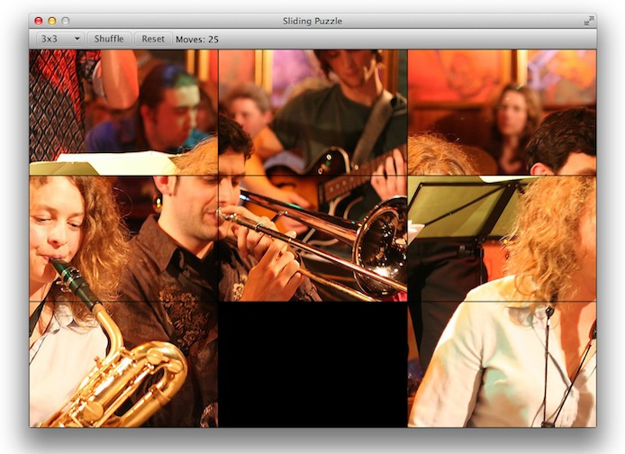

# Sliding Puzzle

[Sliding Puzzle](http://en.wikipedia.org/wiki/Sliding_puzzle) implemented in **Scala** using JavaFX.



Comes in many sizes: 3x2, 3x3, 4x3 and 6x4.

As much as possible, I've tried to have JavaFX-agnostic code. First for better design and second in order to make other implementations easier.

## Building / Running

**IMPORTANT**: 

* Make sure your `JAVA_HOME` is properly set
* Needs JDK 7 or later, since it relies on JavaFX

### Through SBT

Assuming you have SBT set up, run with:

```
sbt run
```

### Eclipse

Otherwise if you are using Scala-IDE or the Eclipse plugin, from within sbt run:

```
eclipse with-source=true
```

and import the project into your workspace. From there launch it as a normal Java application (yes, Java).

## Notes

### About the picture

The musicians you see on the picture are part of a jazz band.


> Tini Thomsen and Matthias Konrad 
> with the Thomsen Group @ Birdland, Hamburg

I wanted to use this picture for this puzzle because it portraits two of my favourite jazz-instruments: 

* **baritone sax** (left)
* **trombone** (right)

Original [picture](http://www.flickr.com/photos/mawel/2322324186/) taken by [Marc Wellekötter](http://www.flickr.com/photos/mawel/)

## TO-DOs

* split tests into corresponding Tile traits
* better names for the tests
* find out why the exception happening when closing from the command line


  
